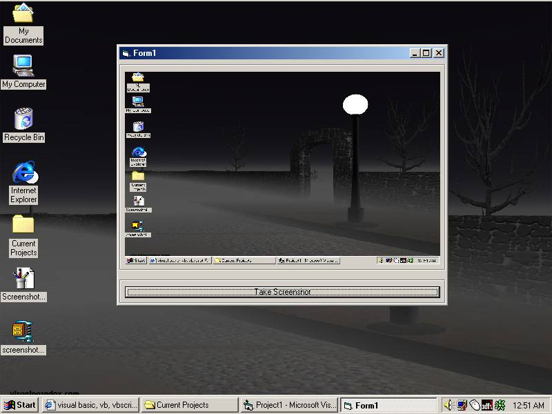



## Screenshot

### Description

Takes a screenshot of the whole screen,saves it as Screenshot.bmp and displays it on the form.
 
### More Info
 

             |
---                |---
**Submitted On**   |2000-11-15 00:49:20
**By**             |[LiquidFrost](https://github.com/Planet-Source-Code/PSCIndex/blob/master/ByAuthor/liquidfrost.md)
**Level**          |Beginner
**User Rating**    |4.2 (25 globes from 6 users)
**Compatibility**  |VB 5\.0, VB 6\.0
**Category**       |[Windows API Call/ Explanation](https://github.com/Planet-Source-Code/PSCIndex/blob/master/ByCategory/windows-api-call-explanation__1-39.md)
**World**          |[Visual Basic](https://github.com/Planet-Source-Code/PSCIndex/blob/master/ByWorld/visual-basic.md)
**Archive File**   |[CODE\_UPLOAD1170211152000\.zip](https://github.com/Planet-Source-Code/liquidfrost-screenshot__1-12802/archive/master.zip)

